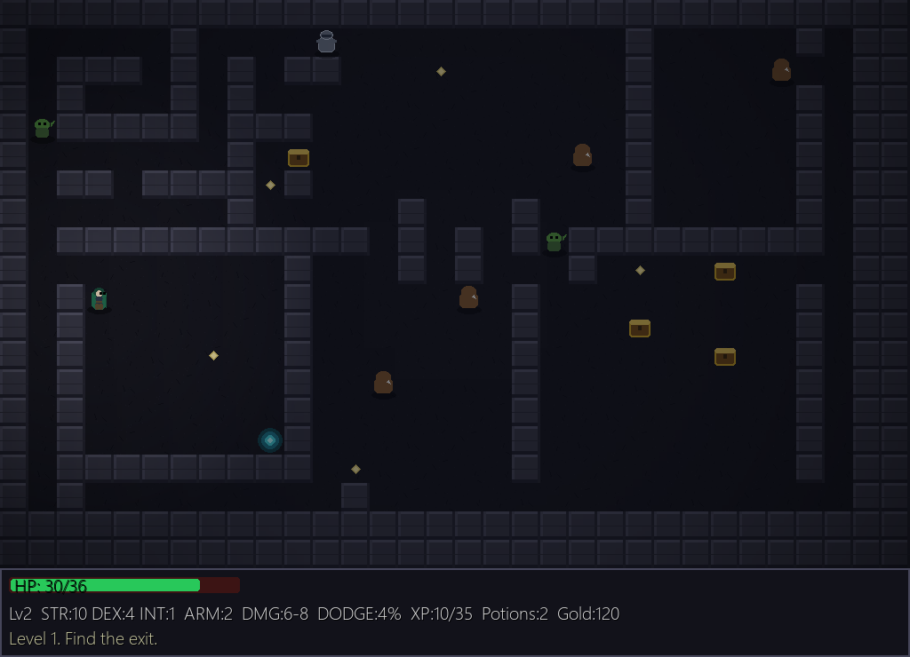

# Le-Mond Roguelike

A turn-based dungeon-crawling roguelike built with **PyGame** — procedurally
generated levels, animated sprite combat, loot and equipment, leveling, magic,
field-of-view fog, particle effects, generative sound, and full **English /
Russian** localization with an in-game language switch.



## Features

- **Procedural dungeons** — rooms, a connecting maze, and loops; entry and exit
  placed as far apart as the layout allows. Deterministic per depth.
- **Sprite animation** — directional idle/walk/attack/hurt states sliced from a
  single atlas, with smooth tile-to-tile movement and knockback effects.
- **Tactical combat** — dodge and double-attack chances scale with dexterity;
  armor reduces incoming damage; directional magic bolts scale with intellect.
- **Loot & equipment** — six equipment slots, two-handed/shield rules, tiered
  weapons and armor, an inventory screen, and healing potions.
- **Progression** — XP, levels, and three classes (Warrior, Thief, Mage). Stat
  and skill points auto-distribute by class, or you can spend them by hand once
  auto-distribution is switched off in the pause menu.
- **Merchant & trainer NPCs** — levels may spawn a merchant (sell loot, buy
  next-tier gear) or a trainer (buy stat/skill points for gold). Walk into them
  to trade instead of fighting.
- **Atmospheric lighting** — smooth radial torchlight, a vignette, drop shadows,
  glowing particles, and screen shake on impact.
- **Field of view** — line-of-sight fog with remembered ("seen") tiles and a
  pause-screen minimap.
- **Five save slots** — saves persist to `%LOCALAPPDATA%` and survive restarts.
- **Localization** — English and Russian, switchable from the start menu and the
  options screen; the choice is stored per save.
- **Generative audio** — all sound effects are synthesized at runtime; no audio
  files required.

## Controls

| Key | Action |
| --- | --- |
| Arrow keys | Move / attack adjacent enemy / talk to an NPC (hold to keep moving) |
| `G` | Grab loot on the current tile |
| `Z` | Drink a healing potion |
| `F` | Cast a directional magic bolt |
| `I` | Inventory (equip / drop) |
| `S` | Stats · `K` Skills (spend points with `1`/`2`/`3` when auto-distribute is off) |
| `O` | Options (animation speed, particles, volume, language) |
| `P` | Pause (minimap, event log, auto-distribute toggles `1`/`2`) |
| `Q` | Quit (asks to save first) |
| `L` | Switch language (start menu) |

## Installation & running

Requires Python 3.11+.

```bash
pip install -r requirements.txt
python -m lemond_pygame
```

Pick or create one of the five save slots, choose a class, and descend.

## Localization

The UI ships with English (`en`) and Russian (`ru`) locales in
`lemond_pygame/locales/`. Game text is looked up by key with an English
fallback, so a missing translation never crashes the game. Switch language with
`L` on the start menu, by clicking the language label, or from the Options
screen; the active language is saved alongside the hero.

## Building a standalone Windows executable

```bash
pip install pyinstaller pygame
pyinstaller le-mond-pygame.spec
```

The spec bundles the sprite atlas and locale files, so the resulting
`dist/le-mond-pygame.exe` runs without the source tree.

## Tech stack

- **Python 3.11+**, **PyGame 2.5+**
- **pytest** for tests, **ruff** + **black** for linting and formatting
- **PyInstaller** for the standalone build
- **GitHub Actions** for CI

## Architecture

The project follows a *pure core + thin layer* split:

- `lemond_pygame/core/` — deterministic, headless game logic with **no PyGame
  dependency**: dungeon generation, entities, combat math, field of view, and
  loot resolution. This is the layer covered by unit tests.
- `lemond_pygame/render.py`, `drawing.py`, `particles.py`, `audio.py` —
  rendering, sprites, particles, and sound.
- `lemond_pygame/ui_*.py` — menus and overlay screens.
- `lemond_pygame/game.py` — the game loop: input and orchestration only.
- `lemond_pygame/i18n.py` + `locales/` — localization.

```
lemond_pygame/
├── core/            # pure logic (tested): config, entities, dungeon, combat, fov, loot
├── render.py        # animation state + map/HUD drawing
├── drawing.py       # tiles and sprite-atlas slicing
├── particles.py     # particle system
├── audio.py         # runtime-synthesized sound
├── i18n.py          # localization lookup
├── locales/         # en.json, ru.json
├── ui_*.py          # start menu, inventory, stats, options, pause
├── game.py          # game loop + bootstrap
└── assets/          # sprite atlas
tests/               # pytest suite for the core
tools/               # screenshot capture helper
```

## Tests & CI

```bash
pip install -r requirements-dev.txt
pytest
ruff check .
black --check .
```

GitHub Actions runs ruff, black, and the pytest suite on every push and pull
request across Python 3.11–3.13.

## License

[MIT](LICENSE) © Alex Dreamien
